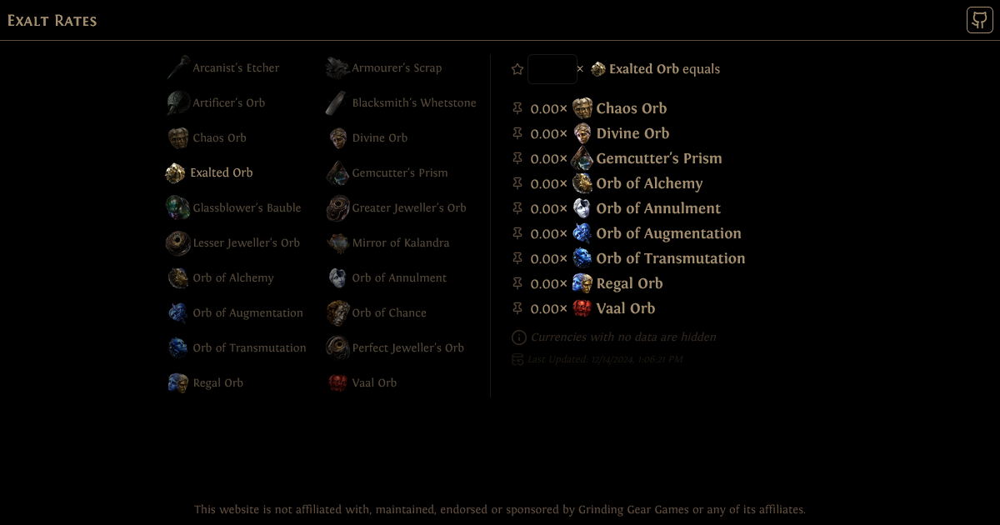

# Exalt Rates

This is a project that aims to provide a simple currency calculator for Path of Exile 2 players. The user can select a primary currency, enter an amount, and see view the exchange rates for other available\* currencies.

> \*A currency is available for display if it has been listed on Path of Exile 2 trading site for the primary currency. So, if a user lists **10x Arcanist's Etcher** for **0.2 Vaal Orb** when the data is being gathered, then it will be listed on Exalt Rates.

## Credits

- **Font**: [Fontin by exljbris](https://www.exljbris.com/fontin.html)
- **Gears Animation**: [Brian-Montierth](https://codepen.io/Brian-Montierth/details/PVZRNj)
